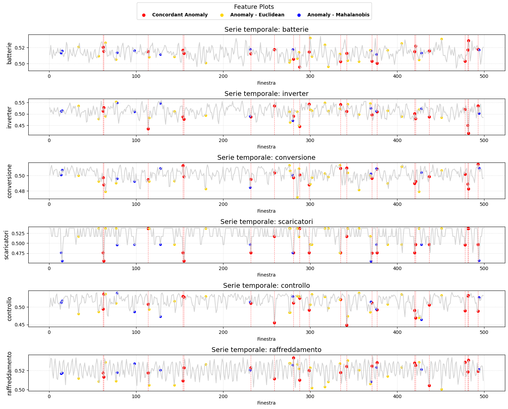
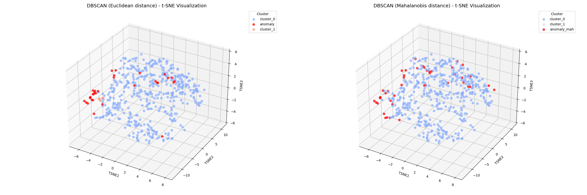
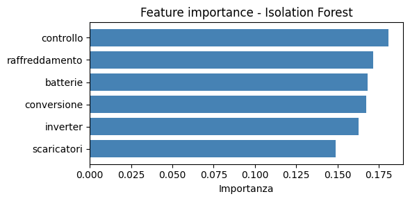
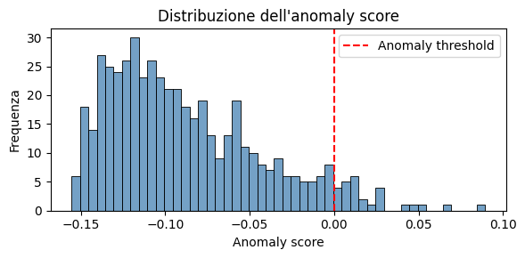
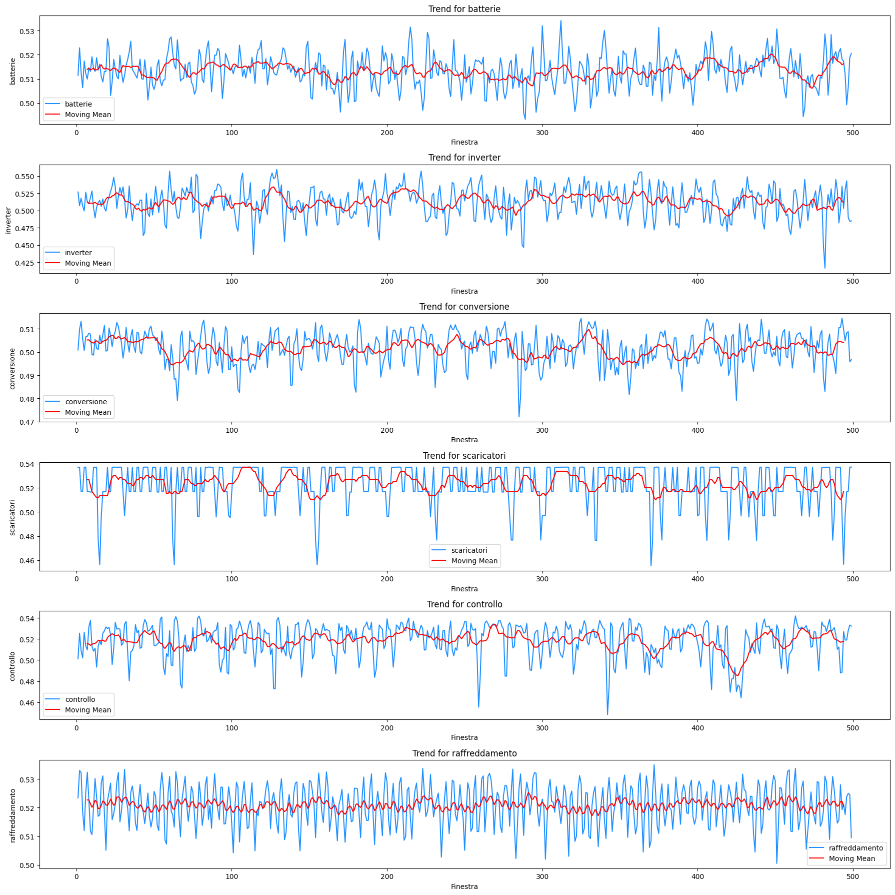
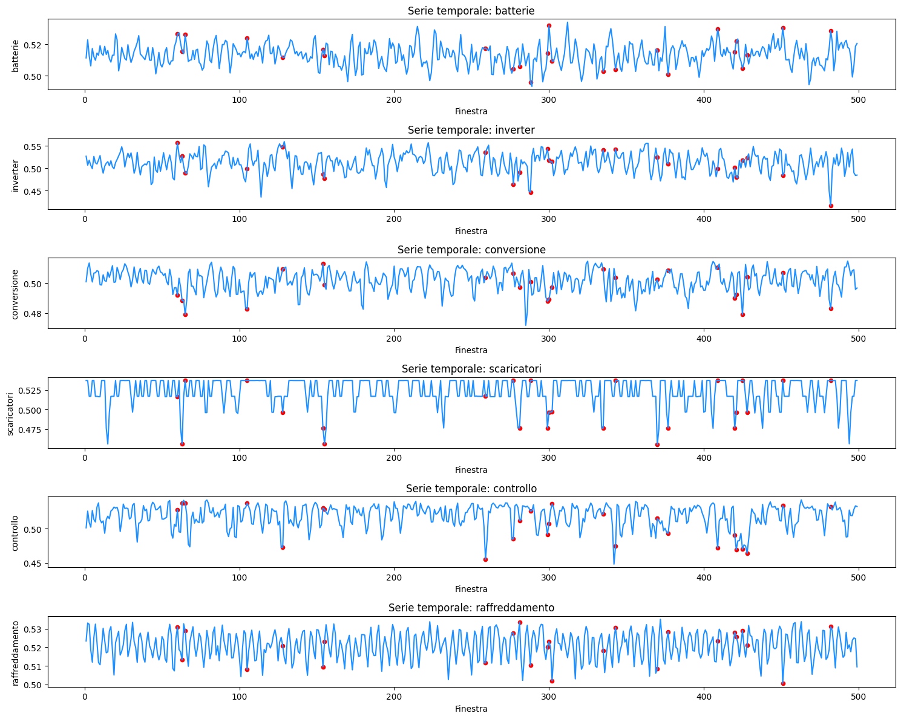

# UPS Anomaly Detection

**Unsupervised anomaly detection on multivariate energy time series from industrial UPS
(Uninterruptible Power Supply) systems**, aimed at predictive maintenance and operational
reliability.

Two independent detectors — a density-based one (**DBSCAN**) and an isolation-based one
(**Isolation Forest**) — are applied to the same signal set and their outputs cross-compared,
so that an anomaly flagged by more than one method carries more weight than one flagged by a
single model.



> Anomalies across the six subsystems. **Red** = flagged by both DBSCAN metrics (highest
> confidence), **yellow** = Euclidean only, **blue** = Mahalanobis only.

---

## The problem

A UPS is the component that keeps a plant running when mains power fails, so a silent
degradation in one of its subsystems is expensive: the fault surfaces exactly when the system
is needed. The practical difficulty is that **failures are rare and unlabelled** — there is no
ground-truth column saying "this window was a fault", which rules out supervised classification
and makes unsupervised detection the natural framing.

The data are **499 time windows** of health indicators for **6 subsystems**:

| Variable | Subsystem |
|---|---|
| `batterie` | Batteries |
| `inverter` | Inverter |
| `conversione` | Power conversion |
| `scaricatori` | Surge arresters |
| `controllo` | Control logic |
| `raffreddamento` | Cooling |

Each value is a normalised health index around ~0.5. `scaricatori` is discrete: it is the
output of an autoencoder fed with two categorical variables.

---

## Results

| Detector | Anomalies found | Selection criterion |
|---|---|---|
| DBSCAN — Euclidean | **32** / 499 (6.4%) | DBCV = 0.408 (`eps=0.021`, `min_samples=5`) |
| DBSCAN — Mahalanobis | **44** / 499 (8.8%) | Silhouette = 0.216 (`eps=1.590`, `min_samples=4`) |
| Both metrics agree | **21** | intersection — highest-confidence set |
| Isolation Forest | 5% contamination | 300 estimators |

The **21 windows flagged by both distance metrics** are the ones worth escalating to a
maintenance team: agreement between two detectors with different geometric assumptions is a
much stronger signal than either alone.



> The same 499 windows in 3-D t-SNE space. Mahalanobis, by accounting for feature covariance,
> flags a wider and more dispersed set than Euclidean.

Isolation Forest ranks `controllo` and `raffreddamento` as the most informative variables for
separating anomalies — consistent with control-logic and cooling faults being the earliest
observable symptoms of UPS degradation.

<p align="center">
  
  
</p>

---

## Method

**1. Exploratory analysis** — [`notebooks/EDA.ipynb`](notebooks/EDA.ipynb)

Series are inspected for trend, distribution and dependence before any model is fitted:
rolling mean, histograms with Q-Q plots, Shapiro-Wilk normality tests, ACF/PACF, ADF and KPSS
stationarity tests, and STL decomposition. The ACF shows no meaningful seasonality, so STL with
`period=2` acts as a denoiser rather than a seasonal decomposition.

<p align="center">
  
</p>

**2. DBSCAN** — [`notebooks/DBSCAN.ipynb`](notebooks/DBSCAN.ipynb)

Density-based clustering labels low-density points as noise (`-1`), which is the anomaly flag.
Two distance metrics are compared:

- **Euclidean** — tuned by grid search on **DBCV**, a density-aware validity index appropriate
  for non-convex clusters, unlike silhouette.
- **Mahalanobis** — computed on standardised data with the inverse covariance matrix, so
  correlations between subsystems are taken into account.

`eps` is chosen from the k-distance elbow, then refined by grid search.

**3. Isolation Forest** — [`notebooks/Isolation_forest.ipynb`](notebooks/Isolation_forest.ipynb)

A tree-based detector that isolates anomalies by random splitting: points needing fewer splits
to isolate are more anomalous. Serves as a methodologically independent cross-check on DBSCAN,
compared through anomaly-score distributions.

<p align="center">
  
</p>

---

## Repository structure

```
notebooks/
  EDA.ipynb                  Exploratory analysis, stationarity, correlation
  DBSCAN.ipynb               Density-based detection, Euclidean + Mahalanobis
  Isolation_forest.ipynb     Tree-based detection and cross-comparison
src/
  project_utils.py           Shared plotting, tuning and model helpers
report/
  AnomaliesDetection.pdf     Full write-up (29 pages)
assets/                      Figures used in this README
```

## Running it

```bash
git clone https://github.com/alessandromaddaloni98/ups-anomaly-detection.git
cd ups-anomaly-detection
python -m venv .venv && source .venv/bin/activate
pip install -r requirements.txt
jupyter lab
```

> **Note on data.** The source dataset (`data/windows_hi.csv`) comes from a real industrial UPS
> installation and is **not redistributable**, so it is not included here. The notebooks are
> committed with their outputs intact, so every result and figure can be inspected on GitHub
> without running them. To re-execute, place a CSV at `data/windows_hi.csv` with a `Finestra`
> column plus the six subsystem columns listed above.

---

## Report

A full write-up of methodology and findings is in
[`report/AnomaliesDetection.pdf`](report/AnomaliesDetection.pdf) (29 pages).

## Authors

Academic project, May–June 2025 — Chiara Caricchia, Claudio Cataldo, Fabio Fontana,
[Alessandro Maddaloni](https://github.com/alessandromaddaloni98).

## License

[MIT](LICENSE)
